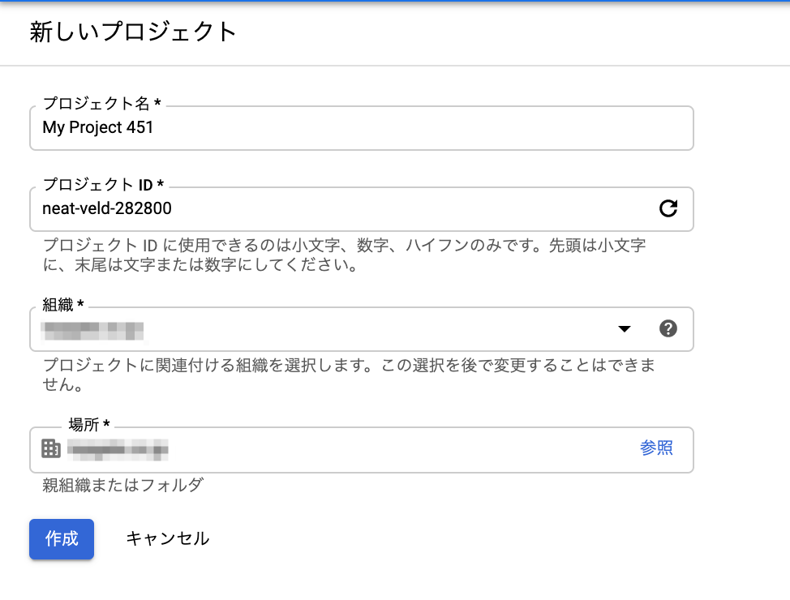

# 1.1プロジェクトの作成
プロジェクトとは
- すべてのGoogle Cloud Resourceの使用、作成の基礎になるもの
- すべてのGoogle Cloud Resourceはプロジェクトに所属する

### プロジェクトの識別
プロジェクトの識別子として以下がある
- プロジェクト名
  - 名前のように意味を理解しやすい（人が理解）名称。一意である必要はない。変更が可能。
- プロジェクトID
  - 自動、もしくは手動で作成するプロジェクトを識別するID。先頭は英小文字、6~30文字の英小文字、数字、もしくはハイフンを使って一意になるように設定する。手動で作成しない場合は自動でIDが設定される。変更は不可能。
- プロジェクト番号
  - 自動で設定される一意のプロジェクト識別子。変更は不可能。
- プロジェクトは組織、またはフォルダに所属することができる

### プロジェクトの作成
1. コンソールからの作成  
リソースの管理からプロジェクトを作成をクリックし作成する


プロジェクトをフォルダに所属させる場合は組織を`組織なし`に設定し、場所を設定する。

2. CLIからの作成  

`gcloud projects` を利用してプロジェクトを作成する
```
gcloud projects create ${PROJECT_ID}
```
親として組織、またはフォルダに所属するプロジェクトを作成する場合は`--organization`または`--folder`オプションを付与する  
いずれかの一方のみに所属可能であるため、オプションはいずれかの一方のみ指定が可能
```
gcloud projects create ${PROJECT_ID}  --organization=${ORGANIZATION_ID}
gcloud projects create ${PROJECT_ID}  --folder=${FOLDER_ID}
```

3. APIからの作成  
`projects.create()`メソッドを利用してプロジェクトを作成する  
https://cloud.google.com/resource-manager/reference/rest/v1/projects/create

- エンドポイント
```
POST https://cloudresourcemanager.googleapis.com/v1/projects
```
- リクエストパラメータ  
プロジェクトの情報を設定する
```
{
  "projectNumber": string,
  "projectId": string,
  "lifecycleState": enum (LifecycleState),
  "name": string,
  "createTime": string,
  "labels": {
    string: string,
    ...
  },
  "parent": {
    "type": string,
    "id": string,
  }
}
```
プロジェクトパラメータのフィールド
|  Key  |  Type  |  Value  |
| ---- | ---- | ---- |
|  projectNumber  |  int64  |  プロジェクト番号  |
|  projectId  |  string  |  プロジェクトID  |
|  name  |  string  |  プロジェクト名  |
|  labels  |  map  |  プロジェクトのラベル。mapでKVで設定する  |
|  parent  |  ResourceId  |  親になる組織、またはフォルダのIDを設定する.typeは"organization"もしくは"folder"のみ設定可能  |

APIで作成されたプロジェクトには請求先アカウントは自動では紐づかないため、別途APIをコールする必要がある