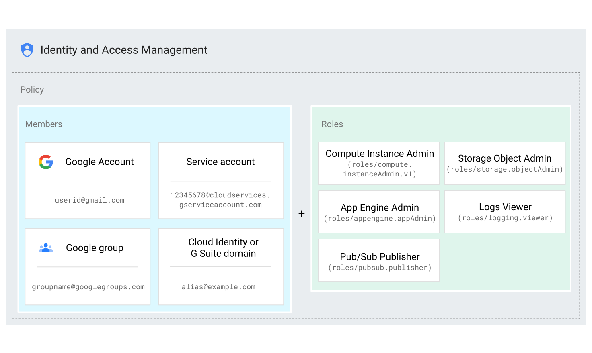

# リソースへのアクセス権の付与、変更、取り消し

### Cloud IAM
誰（ID）がどのリソースに対してどのようなアクセス権（ロール）を持つかを定義することにより、アクセス制御を管理する。  
Cloud IAMは直接エンドユーザーに権限を付与はせず、ロールを介してメンバーに付与される。  
認証されたメンバーがリソースにアクセスしようとするとIAMはリソースのIAMポリシーをチェックしてアクションが許可されているかどうかをチェックします。

### Cloud IAMのアクセス管理モデル


##### Cloud IAMの構成
- メンバー  
リソースへのアクセスが許可されている以下のアカウント
  - Googleアカウント  
    個人レベルで所有するアカウント
  - サービスアカウント  
    アプリケーションのアカウント。各GCPリソースもサービスアカウントを使用して他のGCPリソースにアクセスする
  - Googleグループ  
    Googleアカウントとサービスアカウントの名前付きコレクション
  - G Suiteドメイン  
    組織のG Suiteアカウントで作成されたすべてのGoogleアカウントの仮想グループ
  - Cloud Identityドメイン
    1つの組織のGoogleアカウントの仮想グループを示す。（G Suiteドメインと類似しているが、G Suiteの機能にアクセスはできない）


- ロール  
ロールは権限のコレクション。権限によってリソースへの許可されているオペレーションが決まる
  - 基本の役割  
  GCPで初期定義されているロール。オーナー、編集者、閲覧者がある。（強い権限のため、割り当てには注意が必要）
  - 事前定義の役割  
  GCPで初期定義されているが、基本の役割よりも詳細に設定されているロール。
  - カスタム役割  
  ユーザーが定義するロール

- ポリシー
1つ以上のメンバーを1つの役割にバインドする。

#### 特殊な識別子
- allAuthenticatedUsers  
全てのサービスアカウント及び認証されたGoogleアカウントに対してアクセスを許可する

- allUsers  
  認証されていないユーザーも含め、全てのユーザーに対してアクセスを許可する


### Cloud IAMの付与
Cloud IAMは以下の3通りの方法で付与、剥奪、削除ができる
- GCPコンソール
- gcloudコマンド
- REST API
- クライアントライブラリ

#### GCPコンソールからの付与
- IAMと管理から設定する

#### gcloudコマンドからの付与
- gcloudの`add-iam-policy-binding`を利用して付与し、`remove-iam-policy-binding`を利用して削除する。

コマンド例
```
gcloud GROUP add-iam-policy-binding RESOURCE --member=MENBER --role=ROLE
```

- GROUP  
更新するIAMの単位。projectまたはorganizationを設定する

- RESOURCE  
リソースの名前。projectであればプロジェクトID、organizationであれば組織ID

- MENBER  
ロールを付与するユーザー、サービスアカウントなど。`MEMBER_TYPE:ID`で指定する。  
ex.サービスアカウントの場合  
`--member=serviceAccount:hogehoge.iam.gserviceaccount.com`
ex.ユーザーの場合  
`--member=user:hogehoge@gmail.com`

メンバータイプがuserの場合は識別子に含まれるドメイン名はG SuiteドメインまたはCloud Identityドメインである必要がある。

- ROLE
ロールID。`roles/editor`などの`gcloud iam roles list`で取得できるname

#### REST APIからの付与

- エンドポイント  
`https://iam.googleapis.com`

詳細は以下ドキュメント  
- [Identity and Access Management (IAM) API](https://cloud.google.com/iam/docs/reference/rest)

#### クライアントライブラリからの付与
- googleが各言語用のライブラリを作成しているのでそれを利用する

## IAMポリシーの概要
リソースへのアクセスはIAMポリシーによって管理される。ポリシーはユーザーアカウントやサービスアカウントなどメンバーをロールに関連づけるバインディングのコレクション。  
JSONまたはYAMLで表現される。  

#### IAMポリシーの更新
リソースのポリシーの更新は全て`read-modify-write`パターンを利用する。  
1. `getIamPolicy`で現在のポリシーを取得する
2. 取得したポリシーを編集する
3. `setIamPolicy`でポリシーを更新する

IAMポリシーの取得、更新は以下の方法がある  
- gcloudコマンド
- REST API
- クライアントライブラリ

##### gcloudコマンドによる取得、編集、更新
1. IAMポリシーを取得する  
プロジェクトのIAMポリシーの取得  
`gcloud projects get-iam-policy PROJECT-ID --format=FORMAT > filepath`  
組織のIAMポリシーの取得
`gcloud organizations get-iam-policy ORGANIZATION-ID --format=FORMAT > filepath`  
フォーマットはJSON、またはYAMLを指定できる

2. IAMポリシーの編集
取得したIAMポリシーをローカルで編集する

3. IAMポリシーの設定
編集したIAMポリシーを設定する  
プロジェクトのIAMポリシーの設定
`gcloud projects set-iam-policy PROJECT-ID filepath`
組織のIAMポリシーの設定
`gcloud organizations set-iam-policy ORGANIZATION-ID filepath`

##### RESTAPIによる取得、編集、更新
GOOGLE_APPLICATION_CREDENTIALS環境変数にサービスアカウントの鍵ファイル（json）を設定する
1. IAMポリシーを取得する  
プロジェクトのIAMポリシーの取得  →エラーになってできなかったので余裕があれば確認したい
```
curl -X POST \
-H "Authorization: Bearer "$(gcloud auth application-default print-access-token) \
-H "Content-Type: application/json; charset=utf-8" \
-d @request.json \
https://cloudresourcemanager.googleapis.com/v1/projects/project-id:getIamPolicy
```

2. IAMポリシーの編集
取得したIAMポリシーをローカルで編集する

3. IAMポリシーの設定
編集したIAMポリシーを設定する  
```
curl -X POST \
-H "Authorization: Bearer "$(gcloud auth application-default print-access-token) \
-H "Content-Type: application/json; charset=utf-8" \
-d @request.json \
https://cloudresourcemanager.googleapis.com/v1/projects/project-id:setIamPolicy
```

ex
- GCSにアクセスを行うため、GCSストレージにアクセス可能なサービスアカウントを作成する
```
# サービスアカウントの作成
gcloud iam service-accounts create cloud-strage-service \
    --description="cloud_strage_service" \
    --display-name="cloud-strage-service-disp"

# サービスアカウントにGCSのAdmin権限の付与
gcloud projects add-iam-policy-binding ${PROJECT_ID} \
  --member serviceAccount:`gcloud iam service-accounts list | grep cloud-strage-service-disp | awk '{print $2}'` \
  --role roles/editor

# 作成したサービスアカウントのAPIキーを作成
gcloud iam service-accounts keys create ./credential.json \
  --iam-account `gcloud iam service-accounts list | grep cloud-strage-service-disp | awk '{print $2}'`

```